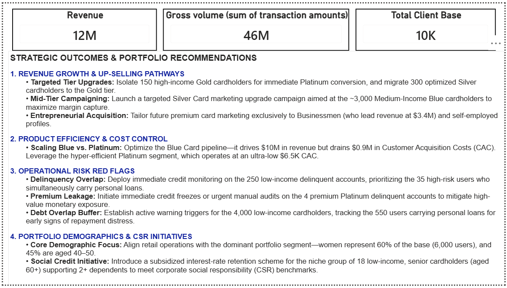
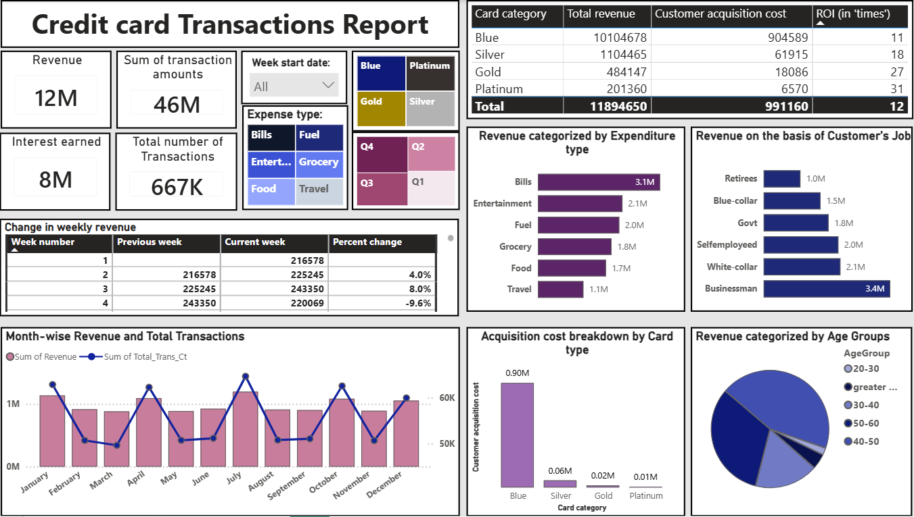
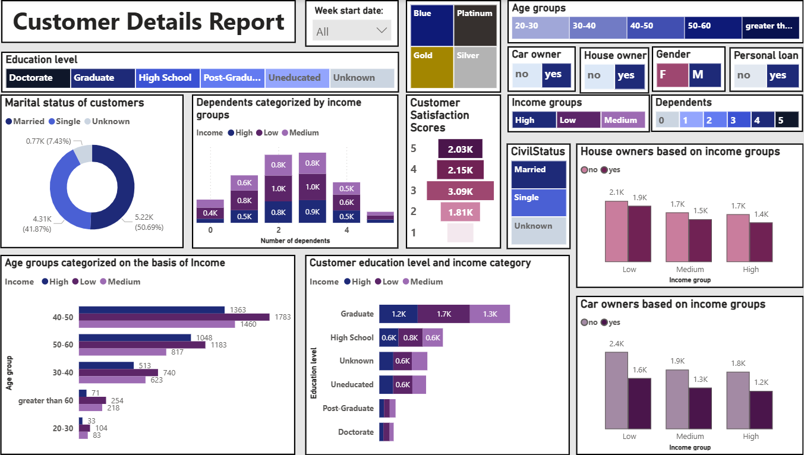

# Power BI Dashboard
## Credit card transactions and Customer analysis dashboard

_Analysis of credit card transactions and a study into the demographic utilising this facility._

---

## Table of contents
- <a href= "#overview">Overview</a>
- <a href= "#business-problem">Business problem</a>
- <a href= "#dataset">Dataset</a>
- <a href= "#tools--technologies">Tools and Technologies</a>
- <a href= "#project-structure">Project Structure</a>
- <a href= "#data-architechture-and-schema">Data Architecture and Schema</a>
- <a href= "#data-cleaning-preparation">Data Cleaning and Preparation</a>
- <a href= "#exploratory-data-analysis">Exploatory Data Analysis</a>
- <a href= "#research-questions-key-findings">Research questions and Key findings</a>
- <a href= "#dashboard">Dashboard</a>
- <a href= "#how-to-run-this-project">How to run this project</a>
- <a href= "#author-contact">Author & Contact</a>

---

<h2><a class="anchor" id="overview"></a>Overview</h2>

A comprehensive end-to-end data analytics project utilizing **MySQL** for data ingestion, storage, and transformation, and **Power BI** for interactive business intelligence reporting. 

The dataset tracks over 10,000 credit card customers, monitoring attributes like transaction volumes, utilization ratios, delinquency statuses, and demographic profiles

---

<h2><a class="anchor" id="business-problem"></a>Business Problem</h2>

Creating a centralized database that integrates data pertaining to the transactions as well as data pertaining to the customers.

Drawing insights that look at parameters beyond revenue and costs, with a goal of understanding the distribution of the client demographic.

---

<h2><a class="anchor" id="dataset"></a>Dataset</h2>

CSV files stored in folder `/data/` 
- credit_card.csv
- creditcard_additional.csv
- customer.csv
- customer_additional.csv

---

<h2><a class="anchor" id="tools--technologies"></a>Tools and Technologies</h2>

- Database Engine: MySQL workbench
- BI Tool: Power BI Desktop
- Query Language: SQL (Data ingestion & preprocessing)
- Analysis Engine: DAX (Data Analysis Expressions for custom metrics)
- Github 

---

<h2><a class="anchor" id="project-structure"></a>Project Structures</h2>

```
sql_creditcard_powerbi_dashboard/
│   gitignore.txt
│   README.md
│
├───dashboard
│       creditcard_dashboard.pbix
│
├───data
│       creditcard_additional.csv
│       credit_card.csv
│       customer.csv
│       customer_additional.csv
│
├───screenshots
└───scripts
        creditcard_data_processing.sql
```

---

<h2><a class="anchor" id="data-architechture-and-schema"></a>Data Architecture and Schema</h2>

The project model relies on two relational tables joined via a **one-to-one (1:1)** relationship linked by the `Client_Num` column.

### 1. Credit Card Details (`CreditCard_details`)
This table holds all transaction-related performance records.

| Column Name | Data Type | Description |
| :--- | :--- | :--- |
| **Client_Num** | `INT` | Unique identifier for each customer |
| **Card_Category** | `VARCHAR(20)` | Tier classification (Blue, Silver, Gold, Platinum) |
| **Annual_Fees** | `INT` | Yearly membership subscription fee |
| **Activation_30_Days** | `INT` | Account activation flag within first 30 days (0 = No, 1 = Yes) |
| **Customer_Acq_Cost** | `INT` | Marketing/operational cost to acquire the customer |
| **Week_Start_Date** | `DATE` | Starting date of the reporting week |
| **Week_Num** | `VARCHAR(20)` | Numerical or textual week identifier (e.g., Week-24) |
| **Qtr** | `VARCHAR(10)` | Financial quarter classification (e.g., Q1, Q2) |
| **current_year** | `INT` | Calendar year of the transaction records |
| **Credit_Limit** | `DECIMAL(10,2)`| Maximum spending limit allocated to the account |
| **Total_Revolving_Bal**| `INT` | Unpaid balance carried over to the next billing cycle |
| **Total_Trans_Amt** | `INT` | Cumulative monetary value of transactions |
| **Total_Trans_Ct** | `INT` | Total weekly transaction frequency count |
| **Avg_Utilization_Ratio**| `DECIMAL(10,3)`| Credit utilization percentage |
| **Use_Chip** | `VARCHAR(10)` | Point-of-sale method used (Chip, Swipe, Online) |
| **Exp_Type** | `VARCHAR(50)` | Expense category channel (Entertainment, Bills, Grocery, etc.) |
| **Interest_Earned** | `DECIMAL(10,3)`| Bank revenue generated from outstanding revolving balances |
| **Delinquent_Acc** | `VARCHAR(5)` | Account delinquency status flag (0 = No, 1 = Yes) |

### 2. Customer Demographics (`customer_details`)
This table stores individual profile attributes, financial commitments, and socioeconomic data for each cardholder.

| Column Name | Data Type | Description |
| :--- | :--- | :--- |
| **Client_Num** | `INT` | Unique identifier for each customer |
| **Customer_Age** | `INT` | Age of the account holder |
| **Gender** | `VARCHAR(5)` | Gender of the cardholder (M / F) |
| **Dependent_Count** | `INT` | Number of financial dependents |
| **Education_Level** | `VARCHAR(50)`| Highest level of education completed |
| **Marital_Status** | `VARCHAR(20)`| Current marital status (Married, Single, Unknown) |
| **State_cd** | `VARCHAR(50)`| State or regional location code |
| **Zipcode** | `VARCHAR(20)`| Postal/ZIP code of the customer's residence |
| **Car_Owner** | `VARCHAR(5)` | Indicates if the customer owns a car (Yes / No) |
| **House_Owner** | `VARCHAR(5)` | Indicates if the customer owns a home (Yes / No) |
| **Personal_Loan** | `VARCHAR(5)` | Indicates if the customer has an active personal loan (Yes / No) |
| **Contact** | `VARCHAR(50)`| Preferred communication method (e.g., Cellular, Unknown) |
| **Customer_Job** | `VARCHAR(50)`| Profession or occupational field of the cardholder |
| **Income** | `INT` | Annual household salary or income level |
| **Cust_Satisfaction_Score**| `INT` | Post-service review score ranked from 1 to 5 |

---

<h2><a class="anchor" id="data-cleaning-preparation"></a>Data Cleaning and Preparation</h2>

- Checked for errors and null values. None were present.
- Changed the date format of 'Week_start_date' column in credit_card.csv from 'dd-mm-yyyy' to 'yyyy-mm-dd' to facilitate easier ingestion into MySQL workbench

---

<h2><a class="anchor" id="exploratory-data-analysis"></a>Exploatory Data Analysis</h2>

- Created a new column 'Revenue' in table 'creditcard_details' using DAX queries in Power BI, which a *SUM* of the columns 'Anual fees', 'Interest earned' and ('Total transaction amount' * 0.02). Here, 0.02 is the merchant fees and is an assumed, average value of the existing merchant fees as per market standards.
- Created a new column 'Week_num_new' in table 'creditcard_details' using DAX queries in Power BI, which provides a week number using the existing column 'Week_start_date'.
- Formatted column 'Week_start_date' to 'dd-mm-yyyy' format for uniformity and convenience.
- Created a new column 'AgeGroup' in table 'customer_details' using DAX queries in Power BI, which categorizes existing column 'Customer_age' into continous data based on age.
- Created a new column 'IncomeGroup' in table 'customer_details' using DAX queries in Power BI, which categorizes existing column 'Income' into continous data based on income.

---

<h2><a class="anchor" id="research-questions-key-findings"></a>Research questions and Key findings</h2>

### 1. Revenue & Product Performance
* **Revenue Leaders:** Businessmen generate the highest revenue at $3.4M, followed closely by white-collar workers at $2.1M, while retirees contribute the least at ~$1M.
* **The Blue Card Core:** The Blue Card acts as the primary revenue engine ($10M) and driver of volume (~600K transactions), but requires the highest customer acquisition cost ($0.9M).
* **The Platinum Segment:** The Platinum Card generates the lowest revenue ($200K) over ~7K transactions, but operates at a highly efficient, ultra-low acquisition cost ($6.5K).
* **Upselling Opportunities:** High-income segments represent clear upgrade pathways— 150 Gold cardholders can be upsold to Platinum, and 300 Silver cardholders can be migrated to Gold.
* **Mid-Tier Growth:** Nearly 3K Medium-Income Blue cardholders form the ideal target audience for a targeted Silver Card marketing upgrade campaign.

### 2. Customer Demographics & Behavior
* **Gender Demographics:** Women form the clear majority of the customer base, representing 6,000 out of the 10,000 total cardholders.
* **Age Distribution:** The portfolio heavily leans toward older demographics— 45% of cardholders are aged 40–50, while young adults (ages 20–30) make up just 2%.
* **Marital Status:** Active cardholders are primarily married (50%) or single (41%), with the remaining 9% recorded as unknown.
* **Education Base:** A significant portion of the user base is highly educated, with nearly 4,000 cardholders holding graduate degrees.
* **Cyclical Transaction Trends:** While monthly revenue holds steady at ~$1M, transaction volumes follow a strict quarterly cycle—spiking to 60K in month one before plateauing at 50K for the remainder of the quarter.

### 3. Risk Management & Strategic Recommendations
* **Delinquency Red Flags:** Out of 624 total delinquent accounts, nearly 250 belong to the Low-Income group. Within this group, 35 users simultaneously hold personal loans, representing a severe default risk.
* **High-Value Risk:** Four delinquent accounts are tied to premium Platinum Cards. These high-price, high-risk lines require immediate credit freezes or urgent manual monitoring.
* **Debt Overlap Monitoring:** Around 4,000 cardholders sit in the low-income tier, with 550 also carrying personal loans. This segment requires active monitoring for early signs of repayment distress.
* **Premium Customer Acquisition:** Businessmen and self-employed individuals dominate the Gold and Platinum tiers. Future premium card marketing should be exclusively tailored to this entrepreneurial profile.
* **Social Credit Initiative:** A niche group of 18 low-income, senior cardholders (aged 60+) support 2+ financial dependents. Introducing a subsidized interest rate scheme for this specific micro-segment can improve retention and support corporate social responsibility (CSR) goals.


---

<h2><a class="anchor" id="dashboard"></a>Dashboard</h2>

- Executive summary:

- Credit card transaction details report:

- Customer details report:


---

<h2><a class="anchor" id="how-to-run-this-project"></a>How to run this project</h2>

### Prerequisites

* [MySQL Server](https://mysql.com) or [MySQL Workbench](https://mysql.com)
* [Microsoft Power BI Desktop](https://microsoft.com)

### Step 1: Database Setup (MySQL)

1. **Clone the Repository:**
   ```bash
   git clone https://github.com/RachanaSubramanya/sql_creditcard_powerbi_dashboard.git
   cd sql_creditcard_powerbi_dashboard
   ```
2. **Open MySQL Workbench:** Connect to your local MySQL instance.
3. **Execute the Script:**
   * Open `scripts/creditcard_data_processing.sql` inside Workbench.
   * Run the script to generate the `creditcarddb` database.
   * *Note: Ensure the `LOAD DATA INFILE` paths in the script point correctly to the absolute paths of the CSV files inside your `/data/` folder.*

### Step 2: Configure Power BI Dashboard

1. **Open the Project:** Open the `dashboard/creditcard_dashboard.pbix` file in Power BI Desktop.
2. **Update Data Source:**
   * On the Home tab, click **Transform Data** --> **Data source settings**.
   * Select the MySQL connection and click **Change Source**.
3. **Connect to Your Local Instance:**
   * **Server:** `127.0.0.1` (or `localhost`)
   * **Database:** `creditcarddb`
   * Click **OK**.
4. **Enter Credentials:** If prompted, choose **Database** authentication, enter your MySQL username (`root`) and your password, then click **Connect**.

### Step 3: Load & View Data

1. Click **Apply Changes** in the yellow warning banner, or click the **Refresh** button on the Home ribbon.
2. Power BI will pull the data directly from your local MySQL database.
3. The interactive visualizations are now ready to use.

---

<h2><a class="anchor" id="author-contact"></a>Author & Contact</h2>

- *Rachana Subramanya*
- email: rachanasubramanya50@gmail.com
- LinkedIn: https://www.linkedin.com/in/rachana-subramanya-4ab0b3303/
- Github: https://github.com/RachanaSubramanya

---
